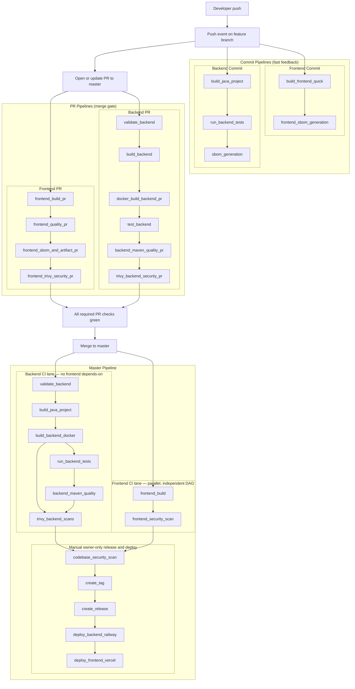

# CI/CD Pipelines Overview

This document describes the current GitHub Actions setup and execution order.

## Unified Pipeline Flow (Mermaid)

## Workflow Summary

### Frontend Commit Pipeline
- File: `.github/workflows/frontend-ci.yml`
- Trigger: `push` (non-master branches), `workflow_dispatch`
- Jobs:
  1. `build_frontend_quick`
  2. `frontend_sbom_generation`

### Frontend PR Pipeline
- File: `.github/workflows/frontend-pr-ci.yml`
- Trigger: `pull_request` to `master`, `workflow_dispatch`
- Jobs (four frontend segments, aligned with backend PR style):
  1. **Build:** `frontend_build_pr` — `npm ci` + `npm run build`
  2. **Quality:** `frontend_quality_pr` — lint (informational), Prettier check, `npm audit` (replaces standalone dependency review)
  3. **SBOM + artifact:** `frontend_sbom_and_artifact_pr` — CycloneDX SBOM, production build, upload `frontend-dist-pr` tarball for Trivy
  4. **Security scans:** `frontend_trivy_security_pr` — Trivy on frontend tree + `frontend/dist` (after artifact extract)

### Backend Commit Pipeline
- File: `.github/workflows/backend-ci.yml`
- Trigger: `push` (non-master branches), `workflow_dispatch`
- Jobs:
  1. `build_java_project`
  2. `run_backend_tests`
  3. `sbom_generation`

### Backend PR Pipeline
- File: `.github/workflows/backend-pr-ci.yml`
- Trigger: `pull_request` to `master`, `workflow_dispatch`
- Jobs (four backend segments, aligned with master):
  1. **Build:** `validate_backend` → `build_backend` → `docker_build_backend_pr` (Docker image artifact for Trivy)
  2. **Test:** `test_backend`
  3. **Maven quality:** `backend_maven_quality_pr` (formatter + CycloneDX SBOM + `dependency:tree`)
  4. **Security scans:** `trivy_backend_security_pr` (pom, image after artifact load, full backend codebase)

### Master Pipeline
- File: `.github/workflows/master-pipeline.yml`
- Trigger: `push` to `master`, `workflow_dispatch`
- Automatic CI is **two parallel DAGs** with **no cross-edges** until manual release steps:
  - **Backend lane (four segments):** (1) `validate_backend` → `build_java_project` → `build_backend_docker` → (2) `run_backend_tests` → (3) `backend_maven_quality` (format + SBOM + `dependency:tree`) → (4) `trivy_backend_scans` (pom, Docker image, full backend dir). No frontend `needs` on backend jobs.
  - **Frontend lane:** `frontend_build` → `frontend_security_scan`.
- Manual owner-only jobs:
  1. `codebase_security_scan` (`workflow_dispatch` only) — **`needs: [trivy_backend_scans, frontend_security_scan]`** (last backend Trivy job + last frontend security job)
  2. `create_tag`
  3. `create_release`
  4. `deploy_backend_railway`
  5. `deploy_frontend_vercel`

### Required GitHub Secrets

The current workflows use the following repository secrets (all in `master-pipeline.yml`):

- `RAILWAY_TOKEN` - Railway API token used by backend deploy job
- `RAILWAY_PROJECT_ID` - Railway project identifier
- `RAILWAY_SERVICE` - Railway backend service name/id used by `railway up`
- `BACKEND_HEALTHCHECK_URL` - public backend health endpoint used post-deploy
- `VERCEL_TOKEN` - Vercel token used by frontend deploy job
- `VERCEL_ORG_ID` - Vercel organization/team ID
- `VERCEL_PROJECT_ID` - Vercel project ID

Notes:
- Store these as Repository Secrets in GitHub (`Settings -> Secrets and variables -> Actions`).
- Deploy jobs are manual/owner-only and depend on these secrets being present.

### Nightly Dependency Check
- File: `.github/workflows/nightly-dependency-check.yml`
- Trigger: scheduled cron + `workflow_dispatch`
- Jobs:
  1. `backend_dependency_updates`
  2. `frontend_dependency_updates`
