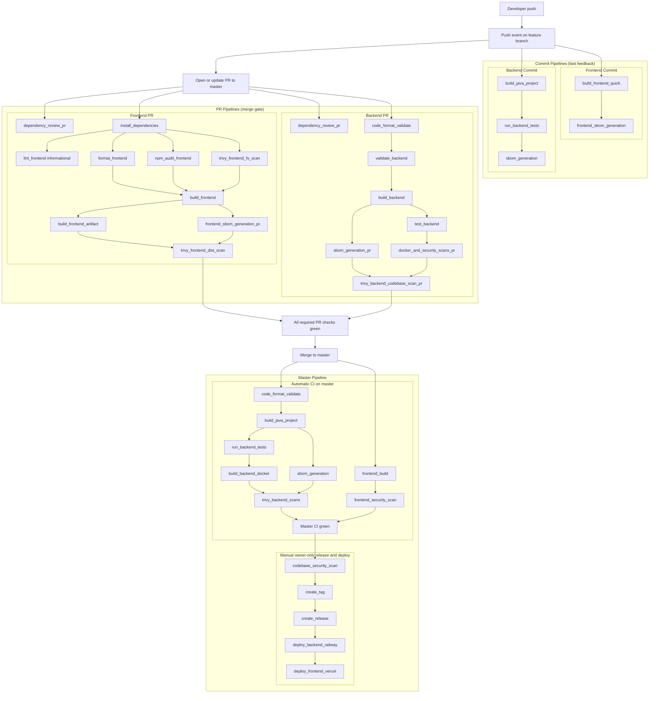

# CI/CD Pipelines Overview

This document describes the current GitHub Actions setup and execution order.

## Unified Pipeline Flow (Mermaid)

## Workflow Summary

### Frontend Commit Pipeline
- File: `.github/workflows/frontend-ci.yml`
- Trigger: `push` (non-master branches), `workflow_dispatch`
- Jobs:
  1. `build_frontend_quick`
  2. `frontend_sbom_generation`

### Frontend PR Pipeline
- File: `.github/workflows/frontend-pr-ci.yml`
- Trigger: `pull_request` to `master`, `workflow_dispatch`
- Jobs:
  1. `dependency_review_pr`
  2. `install_dependencies`
  3. `lint_frontend` (informational)
  4. `format_frontend`
  5. `npm_audit_frontend`
  6. `trivy_frontend_fs_scan`
  7. `build_frontend`
  8. `build_frontend_artifact`
  9. `frontend_sbom_generation_pr`
  10. `trivy_frontend_dist_scan`

### Backend Commit Pipeline
- File: `.github/workflows/backend-ci.yml`
- Trigger: `push` (non-master branches), `workflow_dispatch`
- Jobs:
  1. `build_java_project`
  2. `run_backend_tests`
  3. `sbom_generation`

### Backend PR Pipeline
- File: `.github/workflows/backend-pr-ci.yml`
- Trigger: `pull_request` to `master`, `workflow_dispatch`
- Jobs:
  1. `dependency_review_pr`
  2. `code_format_validate`
  3. `validate_backend`
  4. `build_backend`
  5. `test_backend`
  6. `sbom_generation_pr`
  7. `docker_and_security_scans_pr`
  8. `trivy_backend_codebase_scan_pr`

### Master Pipeline
- File: `.github/workflows/master-pipeline.yml`
- Trigger: `push` to `master`, `workflow_dispatch`
- Automatic CI jobs:
  1. `code_format_validate`
  2. `build_java_project`
  3. `run_backend_tests`
  4. `build_backend_docker`
  5. `sbom_generation`
  6. `trivy_backend_scans`
  7. `frontend_build`
  8. `frontend_security_scan`
- Manual owner-only jobs:
  1. `codebase_security_scan`
  2. `create_tag`
  3. `create_release`
  4. `deploy_backend_railway`
  5. `deploy_frontend_vercel`

### Required GitHub Secrets

The current workflows use the following repository secrets (all in `master-pipeline.yml`):

- `RAILWAY_TOKEN` - Railway API token used by backend deploy job
- `RAILWAY_PROJECT_ID` - Railway project identifier
- `RAILWAY_SERVICE` - Railway backend service name/id used by `railway up`
- `BACKEND_HEALTHCHECK_URL` - public backend health endpoint used post-deploy
- `VERCEL_TOKEN` - Vercel token used by frontend deploy job
- `VERCEL_ORG_ID` - Vercel organization/team ID
- `VERCEL_PROJECT_ID` - Vercel project ID

Notes:
- Store these as Repository Secrets in GitHub (`Settings -> Secrets and variables -> Actions`).
- Deploy jobs are manual/owner-only and depend on these secrets being present.

### Nightly Dependency Check
- File: `.github/workflows/nightly-dependency-check.yml`
- Trigger: scheduled cron + `workflow_dispatch`
- Jobs:
  1. `backend_dependency_updates`
  2. `frontend_dependency_updates`
